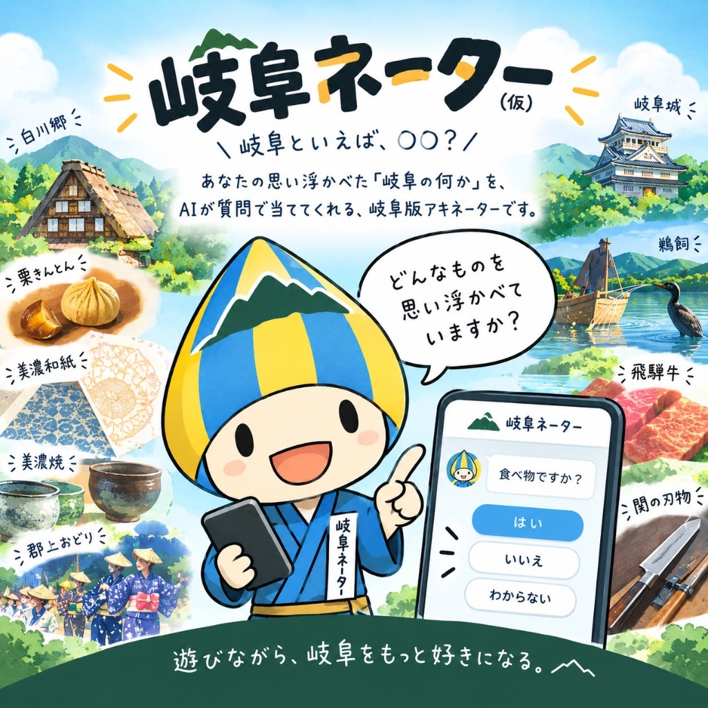
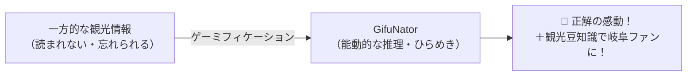

# 🏆 GifuNator（ギフネイター）プレゼン資料
**〜遊びながら、岐阜をもっと好きになる「20の質問」推理ゲーム〜**

> **発表想定時間**: 3〜5分（ハッカソンピッチ用）  
> **公開URL**: https://yasudajs.github.io/GifuNator/  
> **リポジトリ**: https://github.com/yasudajs/GifuNator

---

## 📋 スライド構成一覧

| No | スライドタイトル | テーマ・メッセージ | 想定時間 |
|:---|:---|:---|:---:|
| 1 | **表紙** | GifuNator（ギフネイター）誕生 | 15秒 |
| 2 | **課題提起** | 「岐阜の魅力、本当に届いていますか？」 | 40秒 |
| 3 | **解決策・コンセプト** | 一方的な紹介から、夢中になる「能動的推理」へ | 40秒 |
| 4 | **ゲームシステム・特徴** | テンポ抜群の「3択質問」×「いつでもアタック」 | 50秒 |
| 5 | **実機デモ（見せ場）** | スマホ1つでサクサク動く実際のプレイ画面 | 60秒 |
| 6 | **技術とこだわりの工夫** | サーバー代0円・爆速設計 & 1,350判定の破綻ゼロデータ | 40秒 |
| 7 | **今後の展望・広がり** | オープンデータ連携・自治体タイアップ・観光誘致へ | 35秒 |
| 8 | **まとめ・結び** | 「遊べば、きっと岐阜に行きたくなる。」 | 20秒 |

---

## Slide 1: 表紙

### 【スライド内容】
- **タイトル**: **GifuNator（ギフネイター）**
- **サブタイトル**: 遊びながら、岐阜をもっと好きになる。清流の国「20の質問」推理ゲーム
- **発表者**: [あなたのチーム名 / お名前]
- **QRコード**: （公開サイトへのアクセスQRコードを配置）

> 🗣️ **発表トークスクリプト（15秒）**:  
> 「皆さんこんにちは！本日ご紹介するのは、岐阜にまつわる言葉を『20の質問』で当てるブラウザ推理ゲーム、『GifuNator（ギフネイター）』です。まずは、なぜこのアプリを作ったのか、その想いからお話しさせてください。」

---

## Slide 2: 課題提起（Why Gifu?）

### 【スライド内容】
#### 岐阜の魅力は日本屈指。でも…
- **課題1: 「広すぎて全体像が伝わらない」**  
  美濃と飛騨で文化も気候も特産も全く異なるのに、県外のイメージは「白川郷」や「飛騨牛」など一部に偏りがち。
- **課題2: 「パンフレットやまとめサイトは読まれない」**  
  一方的な観光情報の発信では、そもそも岐阜に興味がないライト層には届かない。

> 🗣️ **発表トークスクリプト（40秒）**:  
> 「岐阜県は、清流・長良川から北アルプス、信長の歴史から世界遺産まで、日本トップクラスの観光資源を持っています。  
> しかし、『美濃と飛騨の違い』や『関の刃物』『郡上八幡の水』といった多彩な魅力を、県外の人に一目で理解してもらうのは簡単ではありません。  
> 従来のパンフレットやWebサイトのような一方的な情報提供では、若者やライト層はなかなか見てくれません。そこで私たちは考えました。『情報を読ませる』のではなく、『自ら推理して発見する楽しさ』を作れないだろうか？と。」

---

## Slide 3: ソリューション（コンセプト）

### 【スライド内容】
#### 逆アキネーター × 岐阜の魅力発見！
- **アプリが岐阜ワードを1つ心に決める**
- **プレイヤーが質問をぶつけて正解を当てる（20の質問スタイル）**
- **「受け身の観光」から「能動的なゲーミフィケーション」へ！**

> 🗣️ **発表トークスクリプト（40秒）**:  
> 「そこで開発したのが『GifuNator』です。世界中で愛される『アキネーター』の形式を逆転させました。  
> アプリが岐阜のキーワードを1つ心に決め、ユーザーが質問をぶつけて『はい』か『いいえ』で絞り込んでいきます。  
> 『それは食べ物ですか？』『飛騨ですか？美濃ですか？』と質問を重ねるプロセスそのものが、岐阜の地理や特産を自然と学ぶ最高の体験になります。」

---

## Slide 4: ゲームシステム・UX設計

### 【スライド内容】
#### スマホで誰もが直感的に遊べる3つの工夫
1. **迷わせない「ランダム3択質問」**:  
   膨大な質問リストから探す手間ゼロ。提示された3枚のカードから選ぶだけ！毎回違う展開が楽しめます。
2. **いつでも逆転「即時アタック」**:  
   「分かった！」と思った瞬間にいつでも解答可能。少ない質問で当てると最高ランク『伝説の岐阜神級 👑』！
3. **初級と上級の2モード**:  
   - 初級: 候補一覧からタップ選択（岐阜ビギナーでも安心）
   - 上級: キーボード直接入力（ガチ勢向け）

> 🗣️ **発表トークスクリプト（50秒）**:  
> 「こだわったのは操作性とゲームテンポです。  
> 自由入力だと『何を質問すればいいか分からない』という壁がありますが、GifuNatorは毎回ランダムに3つの質問カードを提示します。ローグライクカードゲームのようにサクサク選ぶだけで推理が進みます。  
> さらに、答えの候補一覧が常時見られるため、岐阜に詳しくない方でも『あ、候補に白川郷がある！これかも！』と直感的にアタックできます。間違えた選択肢は自動でグレーアウトされる親切設計です。」

---

## Slide 5: 実機デモ（実際のプレイ）

### 【スライド内容】
（プロジェクターに実際のスマホ画面またはPCブラウザを投影）
- **STEP 1**: アイキャッチ（可愛い岐阜キャラの登場）
- **STEP 2**: 「飛騨地方に関係しますか？」→ **【はい】**
- **STEP 3**: 「温泉に関係しますか？」→ **【はい】**
- **STEP 4**: 「下呂温泉」をタップ → **🎉 正解！お見事！**
- **STEP 5**: 下呂温泉の豆知識と𝕏シェアボタン

> 🗣️ **発表トークスクリプト（60秒・実機操作しながら）**:  
> 「では、実際の画面をお見せします！（実機操作）  
> アプリを開くと、岐阜のシンボルが詰まったアイキャッチでお出迎えします。  
> ゲームがスタートしました。今回の質問候補は…『飛騨地方ですか？』。聞いてみます。……『はい』が出ました！  
> 次に『温泉に関係しますか？』……これも『はい』！  
> 飛騨の温泉といえば……下の候補から『下呂温泉』を選んでアタック！  
> 見事正解です！『草津・有馬と並ぶ日本三名泉…』と、下呂温泉の魅力が詳しく表示されます。  
> 結果はワンタップで𝕏にシェアでき、SNSでの拡散・口コミ効果も抜群です。」

---

## Slide 6: 技術とこだわりの工夫

### 【スライド内容】
#### 運用コスト0円 ＆ 破綻のない高品質データ
- **完全静的フロントエンド（HTML5 + CSS3 + Vanilla JS）**:  
  - 外部サーバー不要、LLM API課金リスクゼロ。GitHub Pagesで**恒久的に完全無料公開**。
  - レスポンスは0秒（爆速通信）。
- **徹底したデータ整合性（30お題 × 45質問 ＝ 1,350通りのマトリクス）**:  
  - 「美濃17選」「飛騨13選」を厳選。
  - プログラムによる論理矛盾チェックをクリアし、「下呂温泉に温かい料理ですか？と聞いてはいと答えてしまう」ような違和感を完全に排除。

> 🗣️ **発表トークスクリプト（40秒）**:  
> 「技術面の大きな強みは、**『サーバー代・API代が永久に0円』**で運用できる完全静的アーキテクチャです。  
> LLMを使うとアクセス急増で高額な課金が発生するリスクがありますが、GifuNatorはブラウザ上で完結するため、コンテスト応募後もコストゼロで維持できます。  
> また、美濃・飛騨の代表30選と45個の質問からなる1,350マスの判定マトリクスを独自構築し、論理的矛盾のない完璧な推理体験を実現しました。」

---

## Slide 7: 今後の展望・広がり

### 【スライド内容】
#### 単なるゲームにとどまらない、岐阜の観光ハブへ
1. **オープンデータ連携**:
   - 岐阜県や各市町村の観光オープンデータを取り込み、お題を100選、200選へ拡充。
2. **自治体・観光協会・物産展タイアップ**:
   - 「中津川栗きんとん特集」「関の刃物祭り編」などの限定モード展開。
   - 正解画面からふるさと納税や公式観光予約サイトへの直接送客。
3. **現地連動スタンプラリー**:
   - GPSや現地QRコードと連動し、「現地を訪れると特別な質問やお題が解放される」リアル連動型ゲームへ。

> 🗣️ **発表トークスクリプト（35秒）**:  
> 「GifuNatorのポテンシャルは単なるWebゲームにとどまりません。  
> お題と質問をJSONで独立管理しているため、自治体のオープンデータを取り込んでお題を簡単に追加できます。  
> 例えば、観光協会と連携して『秋の中津川栗きんとん特集』を作ったり、正解画面から特産品の購入やふるさと納税ページへ直接誘導することも可能です。現地を訪れてGPSでチェックインすると解禁されるリアル観光連動も視野に入れています。」

---

## Slide 8: まとめ・結び

### 【スライド内容】
### 「遊べば、きっと岐阜に行きたくなる。」
- **岐阜の魅力を詰め込んだ、誰でも遊べる推理ゲーム**
- **いま、スマホですぐにプレイ可能です！**
- **URL**: `https://yasudajs.github.io/GifuNator/`
- ご清聴ありがとうございました！

> 🗣️ **発表トークスクリプト（20秒）**:  
> 「『GifuNator』は、遊んでいるうちに知らず知らず岐阜のファンになり、次の旅行先にしたくなる、そんなゲームです。  
> 今この瞬間も、お手元のスマートフォンですぐに遊んでいただけます。ぜひ一度、岐阜の奥深い魅力に挑戦してみてください。  
> ご清聴ありがとうございました！」

---

## 💡 審査員からの想定Q&A

- **Q1. 質問数が20問だと簡単すぎませんか？ / 難しすぎませんか？**  
  - **A**: 提示される3択の運要素があるため、平均して5〜10問程度で正解に至る絶妙なバランスになっています。また、上級者向けには選択肢を隠す「直接入力モード」を用意しています。
- **Q2. お題の追加は簡単ですか？**  
  - **A**: はい、JSONファイル1つにお題名・豆知識・質問へのYes/Noを追加するだけで即座にゲームに反映されます。プログラミングの知識がない自治体職員の方でもメンテナンス可能です。
- **Q3. なぜ生成AI（LLM）を使わずに静的ルールベースにしたのですか？**  
  - **A**: 誰でもいつでも無料で遊べる持続可能性（コスト0円）と、ハッカソン審査での通信トラブルや遅延のない「爆速レスポンス」を最優先したためです。
